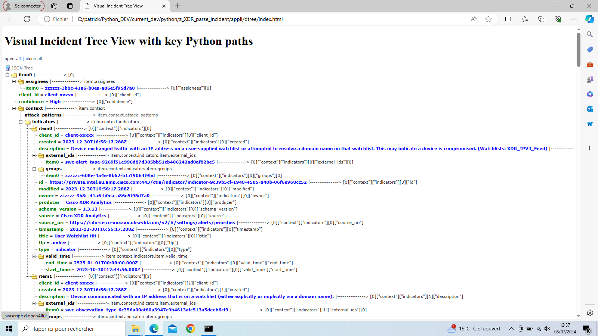

# XDR Incident parser

In this repo you will find examples of codes for parsing XDR Incident described into the **incident-summary.json** file.

## How to do

### Step 1 : put the **incident-summary.json** file to analyse into the **./incident-summary** subfolder

This  **incident-summary.json** file is supposed to have been collected from a XDR Tenant thanks to the **1-select_and_get_incident-summary_from a_source_tenant.py** script located into the  [XDR_copy_and_paste_incidents](https://github.com/pcardotatgit/XDR_copy_and_paste_incidents) repository.

### Have a visual representation of the Incident (Optional) 

Run the **1-incident-summary_json_to_dtree_graph.py** script.

This script creates a javascript tree graph that represent the Incident content. This graph goal is to help you to understant the Incident structure, keys and values.

The goal of this is to help you to parse quickly the data inside the JSON result. 

For this reason the graph contain the key pathes of every keys

Just run the script and once parsing finished after a few second open "./dtree/index.html" from your browser. 

This is a javascript documentation which can be read by your browser

click on the **open all** link at the top of the graph to see the whole file data structure

### Step 2 : Parse the JSON file

run the **2-parse_incident_summary.py** script and have a look the parsing result into the console.

This script gives some example of functions that parse the JSON file and extract from it some data.